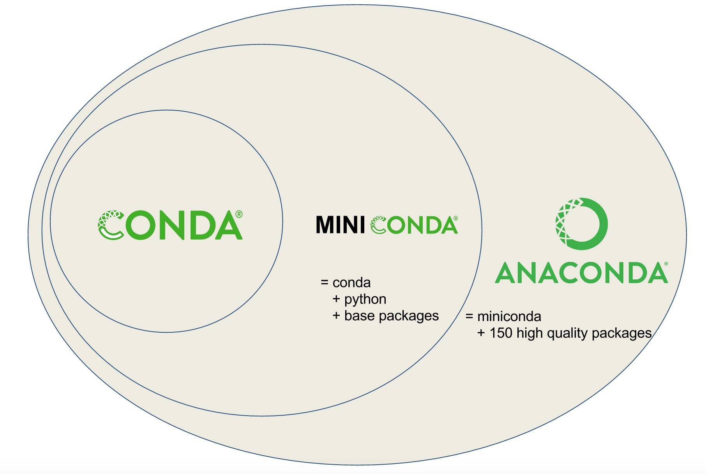

GCB 2020 Tutorial
=================

What exactly is Conda?
----------------------

- A package and environment manager
   - Like apt/yum, but much more flexible
   - Environments are isolated from each other
- User-contributed package recipes
   - Different “channels”, can create your own
   - Updated constantly
- Prebuilt binaries
   - Linked to libraries in the same environment

|tutorial-conda-miniconda-anaconda|

Conda packages
--------------

- Specific versions
- Various sources ("channels")
- Defined requirements
   - Usually from the same or predefined other channels

   ::

      .
      ├── info
      │   └── recipe
      │       ├── conda_build_config.yaml
      │       ├── meta.yaml
      │       └── parent
      └── site-packages
          ├── snakemake
          └── snakemake-5.24.0.dist-info
              └── LICENSE.md

Conda channels
--------------

.. table::
   :class: tutorial
   :width: 100%

   +------------------------------------+------------------------------------+------------------------------------+
   | .. graphviz::                      | .. graphviz::                      | .. graphviz::                      |
   |                                    |                                    |                                    |
   |    digraph {                       |    digraph {                       |    digraph {                       |
   |      "Channel 1"                   |      "Channel 2"                   |      "Channel 3"                   |
   |      [fillcolor=red style=filled]; |      [fillcolor=red style=filled]; |      [fillcolor=red style=filled]; |
   |    }                               |    }                               |    }                               |
   +====================================+====================================+====================================+
   | |  package-1.2.3                   | |  dependency-1.1.2                | |  libgcc-ng-9.3.0                 |
   | |  package-1.2.2                   | |  package-1.2.3                   | |  libcurl-7.71.1                  |
   | |  package-1.2.1                   | |  package-1.2.0                   | |  zlib-1.2.11                     |
   | |  package-1.0.0alpha2             | |  package-1.2.1                   | |  numpy-1.19.1                    |
   | |  package-1.0.0alpha1             | |  package-1.2.0                   | |  scipy-1.5.2                     |
   | |                                  | |  pysam-0.16.0.1                  | |                                  |
   | |                                  | |  samtools-1.10                   | |                                  |
   | |                                  | |  snakemake-5.24.0                | |                                  |
   +------------------------------------+------------------------------------+------------------------------------+

..
   Conda channels
   --------------

- conda-forge: Most dependencies (numpy, scipy, zlib, CRAN packages, etc.)
- bioconda: Most bioinf packages (salmon, STAR, samtools, DESeq2, etc.)
- defaults: Packages built by Anaconda Inc.

- Order matters! Use this one:
   .. code-block:: sh

      $ conda config --show channels
      channels:
        - conda-forge
        - bioconda
        - defaults

      $ conda config --prepend channels bioconda
      $ conda config --prepend channels conda-forge

Finding Packages
----------------

- Search https://anaconda.org
- Use ``conda search``
   .. code-block:: sh

      $ conda search pysam
      Loading channels: done
      # Name                       Version           Build  Channel             
      [...]
      pysam                         0.16.0  py36h71d3148_1  bioconda            
      pysam                         0.16.0  py36h873a209_0  bioconda            
      pysam                         0.16.0  py37ha9a96c6_0  bioconda            
      pysam                         0.16.0  py37hc501bad_1  bioconda            
      pysam                       0.16.0.1  py27ha863e18_1  bioconda            
      pysam                       0.16.0.1  py36h4c34d4e_1  bioconda            
      pysam                       0.16.0.1  py36h71d3148_0  bioconda            
      pysam                       0.16.0.1  py37hc334e0b_1  bioconda            
      pysam                       0.16.0.1  py37hc501bad_0  bioconda            
      pysam                       0.16.0.1  py38hbdc2ae9_1  bioconda            

- Packages have versions, build numbers, build hashes/strings
   - Build hashes include dependency information
- Bioconda packages are also listed at http://bioconda.github.io/conda-package_index.html

Practical 1
-----------

What are the most recent versions of samtools and Snakemake?

.. code-block:: sh

   $ conda search samtools | tail -n1
   samtools                        1.10      h9402c20_2  bioconda            

   $ conda search snakemake | tail -n1
   snakemake                     5.24.0               1  bioconda            

Conda environments
------------------

- A (mostly) self-contained directory with a set of compatible packages
- Uses links to reduce disk space when possible

.. table::
   :class: tutorial

   +---------------------+---------------------------------------------------------+
   | ::                  | .. graphviz::                                           |
   |                     |                                                         |
   |   ├── bin           |    digraph {                                            |
   |   ├── conda-meta    |      rankdir="LR";                                      |
   |   ├── envs          |      node [fillcolor=red style=filled];                 |
   |   │   ├── tutorial  |      "pkgs/foo" -> "env1/foo";                          |
   |   │   ├── pysam     |      "pkgs/foo" -> "env2/foo";                          |
   |   │   ├── samtools  |      "pkgs/foo" -> "env3/foo";                          |
   |   │   └── snakemake |    }                                                    |
   |   ├── etc           +---------------------------------------------------------+
   |   ├── include       | .. code-block:: sh                                      |
   |   ├── lib           |                                                         |
   |   ├── libexec       |    $ ls -1i **/bin/samtools                             |
   |   ├── pkgs          |    116889197 envs/tutorial/bin/samtools                 |
   |   └── share         |    116889197 envs/samtools/bin/samtools                 |
   |                     |    116889197 pkgs/samtools-1.10-h2e538c0_3/bin/samtools |
   +---------------------+---------------------------------------------------------+

..
   Conda environments
   ------------------

- Linking is relative to packages!
- No more conflicting dependencies between versions!

.. code-block:: sh

   $ ldd -r envs/samtools/bin/samtools
   	linux-vdso.so.1 =>  (0x00007ffc684ef000)
   	libhts.so.3 => /home/gcb2020/conda/envs/samtools/bin/../lib/libhts.so.3 (0x00007f32c8eac000)
   	libtinfow.so.6 => /home/gcb2020/conda/envs/samtools/bin/../lib/libtinfow.so.6 (0x00007f32c8e6c000)
   	libncursesw.so.6 => /home/gcb2020/conda/envs/samtools/bin/../lib/libncursesw.so.6 (0x00007f32c8e2f000)
   	libm.so.6 => /lib64/libm.so.6 (0x00007f32c8ad0000)
   	libz.so.1 => /home/gcb2020/conda/envs/samtools/bin/../lib/libz.so.1 (0x00007f32c8e11000)
   [...]

Conda environments -- common commands
-------------------------------------

- ``conda info --envs`` (or ``conda env list``)
   - Lists available environments
   .. code-block:: sh

      $ conda info --envs
      # conda environments:
      #
      base                  *  /home/gcb2020/conda
      tutorial                 /home/gcb2020/conda/envs/tutorial
      pysam                    /home/gcb2020/conda/envs/pysam
      samtools                 /home/gcb2020/conda/envs/samtools
      snakemake                /home/gcb2020/conda/envs/snakemake

   - You start in ``base``
   - The ``*`` indicates the active environment

..
   Conda environments -- common commands
   -------------------------------------

- ``conda create``/``conda env remove``
   - Create/remove environments
   .. code-block:: sh

      $ conda create --name=myenv python=3.8 numpy 'pysam>=0.16'
      $ conda env remove --name=myenv

   - Packages can have versions specified
   - Min/max versions can be specified

..
   Conda environments -- common commands
   -------------------------------------

- ``conda activate``/``conda deactivate``
   - Activates/deactivates an environment
   .. code-block:: sh

      $ command -v samtools
      $ conda activate samtools
      $ command -v samtools
      /home/gcb2020/conda/envs/samtools/bin/samtools
      $ conda deactivate
      $ command -v samtools

   - You can "stack" environments with ``conda activate --stack ...``

..
   Conda environments -- common commands
   -------------------------------------

- ``conda install``/``conda remove``
- ``conda list``
   .. code-block:: sh

      $ conda activate myenv
      $ conda install snakemake
      ... a lot of status output ...
      $ conda list
      ... many packages ...
      $ conda remove snakemake

.. tip::

   - Keep your ``base`` env clean! (only the package manager + its deps)
   - Generously create/remove environments for different tools/workflows!

Introducing ``mamba``
---------------------

- Newer package manager called ``mamba``
- A reimplementation of ``conda``
- Compatible with ``conda``
   - Installed beside ``conda`` in the ``base`` environment
- Much faster than ``conda``
   - Native binary, C++ code
   - Uses another dependency solver, ``libsolv``
- Does not suffer from a yet-to-be-fixed bug in ``conda``
   - ``conda`` may install older versions of ``snakemake``
   - unless ``conda config --prepend repodata_fns repodata.json`` is set

Practical 2
-----------

- Let's create some new environments!
- But first make sure that
   - ``conda`` is up to date
   - The correct channel order is in place

   .. code-block:: sh

      $ conda activate base
      $ conda update --all
      $ conda --version
      conda 4.8.4
      $ conda config --show channels
      channels:
        - conda-forge
        - bioconda
        - defaults
      $ conda config --show-sources
      ==> /home/gcb2020/.condarc <==
      channels:
        - conda-forge
        - bioconda
        - defaults
      $ conda info

Practical 2.1
^^^^^^^^^^^^^

- Create a new environment named "mapping" with ``bwa-mem2`` and ``pysamstats``
- What versions of ``numpy`` and ``python`` got installed in it?

.. code-block:: sh

   $ conda create --name=mapping bwa-mem2 pysamstats
   $ conda activate mapping
   $ conda list | grep -E '^(python|numpy)\>'
   numpy                     1.19.1           py38hbc27379_2    conda-forge
   python                    3.8.5           h1103e12_7_cpython    conda-forge
   $ conda list '^(numpy|python)$'

Practical 2.2
^^^^^^^^^^^^^

- Create a new environment for Snakemake with ``mamba``

.. code-block:: sh

   $ conda install --name=base mamba
   $ mamba --version
   mamba 0.5.1
   conda 4.8.4
   $ mamba create --name=snakemake snakemake
   $ conda activate snakemake
   $ snakemake --version
   5.24.0

Conda environments -- common commands
-------------------------------------

- ``conda env export``/``conda env create``
   - Exports or creates an environment from a YAML file

   .. code-block:: sh

      $ conda env export --no-builds > env.yaml
      $ conda env create --name=more-map-and-call --file=env.yaml
      $ head env.yaml
      name: map-and-call
      channels:
        - conda-forge
        - bioconda
        - defaults
      dependencies:
        - _libgcc_mutex=0.1
        - _openmp_mutex=4.5
        - bcftools=1.10.2
        - blis=0.7.0

Common pitfalls
---------------

- Wrong channel order
- Installing packages in your ``base`` env
- Manually manipulating ``$PYTHONPATH``
- Avoid manually (i.e., not via ``conda``/``mamba``) installed packages

Conda package recipes
---------------------

.. code-block:: sh

   $ tree -A recipes/varlociraptor
   recipes/varlociraptor/
   ├── build.sh
   └── meta.yaml

- ``meta.yaml`` is required
- optional:
   - ``build.sh``
   - (small) test files
   - license file

``meta.yaml`` sections
----------------------

- ``package``: name and version
- ``source``: url and SHA256/MD5 checksums
- ``build``: build number, platforms to skip, "noarch" information
- ``requirements``: packages for building, linking, running
- ``test``: commands/imports
- ``about``: webpage, license, summary of what the package does
- ``extras``: comments, maintainers, etc.

``package``
^^^^^^^^^^^

.. code-block:: yaml+jinja

   package:
     name: unifrac
     version: 0.20.0

Can also use Jinja variables:

.. code-block:: yaml+jinja

   

   package:
     name: unifrac
     version: {{ version }}

``source``
^^^^^^^^^^

.. code-block:: yaml+jinja

   source:
     url: https://github.com/biocore/unifrac/archive/{{ version }}.tar.gz
     sha256: e2692c683fddc6450ca4da049112b00264cf61aef1071d2ebc0f0539b86611b8

- Avoid ``git_url``/``svn_url``
- Only actual releases, no alpha/beta

``build``
^^^^^^^^^

.. code-block:: yaml+jinja

   build:
     number: 0

- Reset to ``0`` with new releases
- Increment with each change for same version
- Can skip build on conditions
   .. code-block:: yaml+jinja

      build:
        number: 0
        skip: True  # [osx or py<36]

..
   ``build``
   ^^^^^^^^^

- ``noarch`` is useful, but has special semantics

   - ``generic``: No platform-specific code (Java, pure Perl, pure R, etc.)
      .. code-block:: yaml+jinja

         build:
           number: 0
           noarch: generic

   - ``python``: Pure Python packages, one build -> all versions
      .. code-block:: yaml+jinja

         build:
           number: 0
           noarch: python

   - Not usable with ``# [condition]`` selectors
   - Only if using ``noarch: python``:
      - use ``- python >=3.0`` instead of ``skip: True  # [py<30]``

..
   ``build``
   ^^^^^^^^^

- You can include entire build command

   .. code-block:: yaml+jinja

      build:
        number: 0
        noarch: python
        script: {{ PYTHON }} -m pip install . --no-deps -vv

- Alternatively, use ``build.sh`` for "more involved" installs

   .. code-block:: sh

      $ cat build.sh
      # !/usr/bin/env bash
      "${PYTHON}" -m pip install . --no-deps -vv

- There are more predefined `environment variables in conda-build <https://docs.conda.io/projects/conda-build/en/latest/user-guide/environment-variables.html#environment-variables-set-during-the-build-process>`_

``requirements``
^^^^^^^^^^^^^^^^

.. code-block:: yaml+jinja

   requirements:
     build:
       - {{ compiler('c') }}
     host:
       - htslib
       - zlib
     run:
       - htslib
       - zlib

- ``build``: Compilers, preprocessors, etc.
- ``host``: Anything linked against
- ``run``: All other dependencies
- Use compiler functions (``{{ compiler('cxx') }}`` and such)

A note on "pinnings"
^^^^^^^^^^^^^^^^^^^^

- Packages need to be compatible
- Same compiler per platform
- Same ``htslib``/``numpy``/``zlib``/``libcurl``/etc. versions
- Above are "pinned"

.. code-block:: sh

   $ conda search samtools | tail -n1
   samtools                        1.10      h9402c20_2  bioconda

- The hash ``h9402c20`` above is specific to the used pinning
- Bioconda uses `conda-forge-pinning <https://github.com/conda-forge/conda-forge-pinning-feedstock/blob/master/recipe/conda_build_config.yaml>`_
- Version ranges are very useful!

   .. code-block:: yaml+jinja

      - importlib_metadata >=1.7.0,<2.0.0
      - pysam >=0.16,<0.17
      - python >=3.7
      - pyyaml >=5.3,<6

``test``
^^^^^^^^^^^^^^^^^^^^^^^^^

.. code-block:: yaml+jinja

   test:
     imports:
       - vembrane
     commands:
       - vembrane --help

- Keep it simple/quick but functional
- No large test files
- ``imports`` works for Python/Perl

``about``/``extra``
^^^^^^^^^^^^^^^^^^^^^^^^^^^^^^^^^^^^

.. code-block:: yaml-jinja

   about:
     home: https://github.com/vembrane/vembrane
     license: MIT
     license_file: LICENSE
     summary: Filter VCF/BCF files with Python expressions.

   extra:
     recipe-maintainers:
       - felixmoelder
       - mbargull

- Please include ``license`` and ``license_file``!

Don't fear skeletons
--------------------

- Making recipes manually takes time
- Many common sources are automated
   .. code-block:: sh

      $ mkdir recipe
      $ cd recipe
      $ conda-skeleton pypi vembrane
- Skeletons for: PyPI, CPAN, CRAN
   - For CRAN: https://github.com/bgruening/conda_r_skeleton_helper
   - CRAN packages belong on conda-forge if possible!
   - For PyPI: ``grayskull`` is a newer/improved implentation
- We (Bioconda) already make ALL Bioconductor packages
- On `bioconda-recipes <https://github.com/bioconda/bioconda-recipes>`_, recipes are in ``recipes/``

Practical 3
-----------

Make a new ``cutadapt`` recipe

.. code-block:: sh

   $ conda create --name=conda-build conda-build
   $ conda activate conda-build
   $ mkdir recipes
   $ cd recipes
   $ conda-skeleton pypi cutadapt
   $ $EDITOR cutadapt/meta.yaml  # edit build, host requirements, license_file

Common problems
---------------

- Compiling C/C++ packages can be troublesome
- The compiler is NOT called ``gcc``
- Installed into ``$PREFIX``
- Library dependencies are in ``$PREFIX/lib``

.. code-block:: sh
   $ cat build.sh
   #! /usr/bin/env bash
   make install \
       CC="${CC}" \
       CXX="${CXX}" \
       CFLAGS="${CFLAGS}" \
       CXXFLAGS="${CXXFLAGS}" \
       LDFLAGS="${LDFLAGS}" \
       prefix="${PREFIX}"

Practical 4 and/or Q&A
----------------------

- `bioconda-recipes <https://github.com/bioconda/bioconda-recipes>`_ tour?
- Want to contribute new packages?
   - Anything you need but could not find in Bioconda?
   - Candidates from the GCB 2020 book of abstracts:
      - `BiCoN <https://github.com/biomedbigdata/BiCoN>`_: Python package
      - `MeDeMo <http://www.jstacs.de/index.php/MeDeMo>`_: JAR file
      - `STITCHIT <https://github.com/SchulzLab/STITCHIT>`_: C++/CMake
      - `TEPIC <https://github.com/SchulzLab/TEPIC>`_: Python + R + C++
      - `PrediTALE <https://www.jstacs.de/index.php/PrediTALE>`_: JAR file
      - `InstantDL <https://github.com/marrlab/InstantDL>`_: Python package
      - `FilterFFPE <https://github.com/LanyingWei/FilterFFPE>`_: pending addition to Bioconductor
- Questions?
