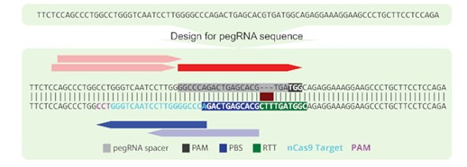

pedesigner - A pegRNA tool for CRISPR prime editing
====================================================
(originally from: [PE-Designer](https://github.com/Gue-ho/PE-Designer))

Prime editing tools that consist of a reverse transcriptase linked with Cas9 nickase are capable of generating targeted insertions, deletions, and base conversions without producing DNA double strand breaks or requiring any donor DNA.

[PE-Designer](https://academic.oup.com/nar/article/49/W1/W499/6262559) is a tool for pegRNA design and selection. It provides all possible target sequences, pegRNA extension sequences, and nicking guide RNA sequences, together with useful information.

