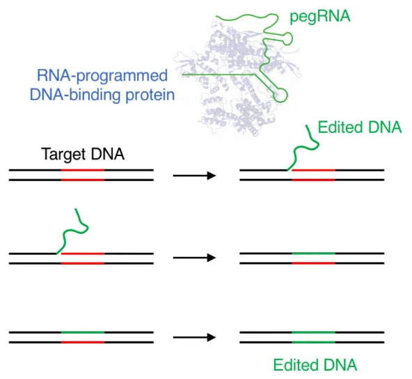

pedesigner - A pegRNA tool for CRISPR prime editing
===================================================

# **_original code: [PE-Designer](https://github.com/Gue-ho/PE-Designer)_**

Prime editing tools that consist of a reverse transcriptase linked with Cas9 nickase are capable of generating targeted insertions, deletions, and base conversions without producing DNA double strand breaks or requiring any donor DNA.

[PE-Designer](https://academic.oup.com/nar/article/49/W1/W499/6262559) is a tool for pegRNA design and selection. It provides all possible target sequences, pegRNA extension sequences, and nicking guide RNA sequences, together with useful information.

---

Usage:
=====

With no CPU's allocated:
pedesigner -m <mm> --pbs\_min <pbs_min> --pbs\_max <pbs_max> --rtt\_min <rtt_min> --rtt\_max <rtt_max> --use\_cpus <ref.fa> <edit.fa> <PAM> <genome.fa>

With CPU's allocated (e.g.; cluster, snakemake etc): 
pedesigner -m <mm> --pbs\_min <pbs_min> --pbs\_max <pbs_max> --rtt\_min <rtt_min> --rtt\_max <rtt_max> <ref.fa> <edit.fa> <PAM> <genome.fa>

